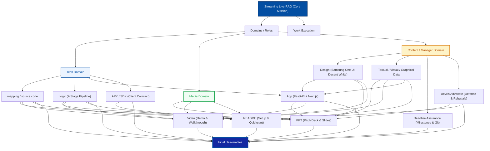

# 01. Domains and System Architecture
## Samsung PRISM GenAI Hackathon (3rd Edition, 2026–27) · Theme 04: Streaming Live RAG

This document formalizes the holistic architecture of the project based on the official hackathon organizational diagram, mapping domains, sub-roles, data flows, and final deliverables into a production-grade live streaming RAG system.

---

## 1. Hackathon Domains & Roles Graph

---

## 2. Domain Breakdown & Responsibilities

### 2.1 Tech Domain
The engineering core powering real-time streaming, high-throughput retrieval, and sub-150ms TTFT (Time To First Token).
* **`mapping / source code`**:
  * Unified corpus indexing (`Galaxy S25/S24 series`, `Galaxy Z Fold6/Flip6`, `Galaxy Book4/5 Ultra`, `Galaxy Watch Ultra`, `SmartThings & One UI 7`).
  * End-to-end component traceability mapping between requirements, algorithms, and source files.
* **`Logic`**:
  * Dual-mode decision gate (RAG vs direct general API).
  * Speculative prefetch and query decomposer.
  * Parallel hybrid retrieval: Lexical BM25 (sparse) + MiniLM-L6-v2 (dense embeddings).
  * Reciprocal Rank Fusion (RRF with $k=60$).
  * Cross-encoder neural re-ranking (`ms-marco-MiniLM-L-6-v2`).
  * Context sharpening & dynamic token-budget filtering ($\beta=0.5$).
  * Speculative synthesis stream via Server-Sent Events (SSE).
* **`app`**:
  * **Backend**: FastAPI asynchronous service running on Groq LPU models (`llama-3.3-70b-versatile`, `mixtral-8x7b-32768`).
  * **Frontend**: Next.js 14 React client with real-time SSE parsing, dynamic pipeline telemetry, and interactive pipeline stage inspector.
* **`APK / SDK`**:
  * OpenAI-compatible streaming API specifications (`POST /api/query/stream`).
  * Modular Python client library (`app/backend/src/client.py`) and TypeScript SDK wrapper.
  * Standardized JSON payload contracts ready for embedding into Android/One UI client apps.

---

### 2.2 Media Domain
The narrative and visual assets communicating project impact, technical depth, and business feasibility to hackathon evaluators.
* **`ppt`**:
  * **Judge Deck**: Formal 12-slide Microsoft PowerPoint file (`deliverables/Samsung_PRISM_Live_Streaming_RAG_Pitch.pptx`).
  * **In-App Slide Presentation**: Dynamic web-based presentation route (`/presentation`) built directly into the Next.js frontend with keyboard navigation.
* **`video`**:
  * Detailed minute-by-minute demo walkthrough scripts (`06_VIDEO_DEMO_WALKTHROUGH_SCRIPT.md`) with cue cards, exact user queries, and UI interaction guidance.
* **`README`**:
  * Comprehensive developer onboarding documentation (`README.md`), configuration instructions (`.env.example`), architecture diagrams, API specs, and Vercel hosting guides.

---

### 2.3 Content / Manager Domain
Quality governance, visual consistency, risk mitigation, and empirical proof.
* **`Design`**:
  * **Samsung One UI Decent White**: Pristine white surfaces (`#FFFFFF`), light gray backgrounds (`#F8F9FA`), subtle borders (`#E2E8F0`), and classic Samsung Blue accents (`#034EA2`).
  * Complete elimination of raw markdown syntax; rich visual cards, formatted spec comparison tables, pill badges, and glassmorphic telemetry panels.
* **`Textual / Visual / Graphical Data`**:
  * Live telemetry graphs tracking TTFT, tokens-per-second, stage-by-stage latencies, BM25 vs Vector rank distributions, and cross-encoder score distributions.
* **`Deadline Assurance`**:
  * Versioned milestone management with Git release tag `PRISM_GENAI_HACKATHON_Y2026`.
  * Multi-layer local and external backup synchronization (`D:\Samsung-PRISM-Hackathon`).
  * Continuous automated build and lint checks ensuring zero compile errors.
* **`Devil's Advocate`**:
  * Proactive defense dossiers tackling potential judge scrutiny on multi-stage latency overhead, hallucination boundaries, vector vs hybrid retrieval necessity, and edge device scalability.

---

### 2.4 Final Deliverables
The synchronized package submitted for judging:
1. **Live Interactive Application**: Frontend running on port 3000, Backend on port 8000.
2. **Interactive Stage Inspector**: Visual verification tool for all 8 pipeline phases.
3. **PowerPoint Pitch Deck**: Both `.pptx` file and interactive `/presentation` route.
4. **Explainable System Repository**: The `deliverables/system_explainability/` directory.
5. **Production Deployability**: Clean Vercel (`vercel.json`) and Git push compatibility.
