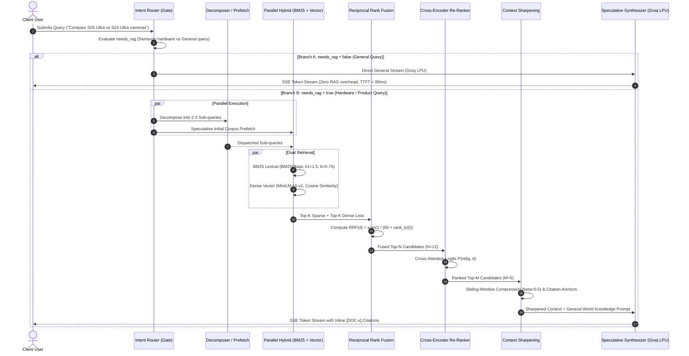

# 02. Algorithmic Logic Deep Dive
## Samsung PRISM GenAI Hackathon (Theme 04: Streaming Live RAG)

This document provides a rigorous mathematical and structural breakdown of the 7-stage speculative RAG pipeline and dual-mode decision gate.

---

## 1. High-Level Pipeline Sequence



---

## 2. Stage-by-Stage Mathematical Formulations

### Stage 0: Intent Router & Dual-Mode Gate
* **Objective**: Eliminate RAG latency and hallucination overhead on generic conversational queries while ensuring comprehensive RAG coverage on domain-specific product queries.
* **Mechanism**:
  $$\text{Intent}(Q) = \begin{cases} 
  \text{RAG\_STREAM} & \text{if } \text{Entities}(Q) \cap \mathcal{E}_{\text{Samsung}} \neq \emptyset \lor \text{IntentType}(Q) \in \{\text{Specs, Pricing, Comparison, Troubleshooting}\} \\
  \text{GENERAL\_STREAM} & \text{if } Q \in \{\text{Chitchat, General Science, World Knowledge, Abstract Coding}\} 
  \end{cases}$$
* **Low-Latency Implementation**:
  Fast pre-compiled entity matching combined with Groq LPU zero-shot classification with JSON schema enforcement (`needs_rag: bool, mode: string, reason: string`).

---

### Stage 1: Speculative Prefetch & Query Decomposer
* **Objective**: Break complex multi-faceted queries (e.g., *"How do S25 Ultra's Nightography and battery compare to Fold6?"*) into atomic retrieval targets.
* **Algorithm**:
  Given user query $Q$, generator decomposes $Q$ into atomic sub-queries:
  $$\mathcal{Q}^* = \{q_1, q_2, \dots, q_m\} \quad \text{where } m \le 3$$
* **Speculative Parallelism**:
  While decomposition runs asynchronously, the raw query $Q$ begins an immediate prefetch on the dense index, overlapping retrieval network latency with LLM inference.

---

### Stage 2: Parallel Hybrid Retrieval (Sparse + Dense)
* **Objective**: Overcome vocabulary mismatch (where vector search fails on exact product SKUs like *"SM-S928B"*, *"Snapdragon 8 Gen 3 for Galaxy"*) and semantic blindness (where BM25 fails on conceptual queries like *"phone that folds and fits in small pockets"*).
* **BM25 Lexical Formulation (Sparse)**:
  $$\text{Score}_{\text{BM25}}(D, q) = \sum_{t \in q} \text{IDF}(t) \cdot \frac{f(t, D) \cdot (k_1 + 1)}{f(t, D) + k_1 \cdot \left(1 - b + b \cdot \frac{|D|}{\text{avgdl}}\right)}$$
  Where $k_1 = 1.5$, $b = 0.75$, and $\text{IDF}(t) = \ln \left( \frac{N - n(t) + 0.5}{n(t) + 0.5} + 1 \right)$.
* **Dense Vector Similarity**:
  $$\text{Score}_{\text{Dense}}(D, q) = \cos(\mathbf{e}_q, \mathbf{e}_D) = \frac{\mathbf{e}_q \cdot \mathbf{e}_D}{\|\mathbf{e}_q\|_2 \|\mathbf{e}_D\|_2}$$
  Computed using `all-MiniLM-L6-v2` embeddings in ChromaDB.

---

### Stage 3: Reciprocal Rank Fusion (RRF)
* **Objective**: Fairly merge disparate score distributions (unbounded BM25 scores vs bounded $[0, 1]$ cosine similarities) without fragile score normalization.
* **Formulation**:
  $$\text{RRF\_Score}(d) = \sum_{m \in \{\text{dense}, \text{sparse}\}} \frac{1}{k + r_m(d)}$$
  Where:
  * $k = 60$ (standard Cormack et al. constant to reduce sensitivity to outlier ranks).
  * $r_m(d)$ is the 1-based rank position of document $d$ in the output list of retriever $m$. If document $d$ is missing from list $m$, its penalty is $r_m(d) = \infty$ (i.e. term evaluates to 0).

---

### Stage 4: Cross-Encoder Re-Ranking
* **Objective**: Resolve multi-turn relevance and semantic subtlety using full cross-attention over all token pairs $(q_i, d_j)$ rather than bi-encoder dot products.
* **Cross-Attention Formulation**:
  $$\mathbf{H} = \text{Transformer}(\text{[CLS]} \circ q \circ \text{[SEP]} \circ d \circ \text{[SEP]})$$
  $$\text{Score}_{\text{CE}}(q, d) = \sigma\left(\mathbf{W}_{\text{logit}} \cdot \mathbf{H}_{\text{[CLS]}} + b\right) \in [0, 1]$$
* **Model**: `cross-encoder/ms-marco-MiniLM-L-6-v2` re-ranks top 12 RRF candidates down to top 5 precision candidates.

---

### Stage 5: Context Sharpening & Dynamic Token Budgeting
* **Objective**: Remove irrelevant sentences within retrieved chunks, enforce strict token budgets, and inject explicit citation anchors.
* **Algorithm**:
  For each chunk $D_i$ in top $K$, split into constituent sentences $\{s_{i,1}, s_{i,2}, \dots, s_{i,p}\}$.
  Compute sentence relevance score:
  $$\rho(s_{i,j}, q) = \alpha \cdot \text{LexicalOverlap}(s_{i,j}, q) + (1 - \alpha) \cdot \cos(\mathbf{e}_{s_{i,j}}, \mathbf{e}_q)$$
  Select sentences satisfying $\rho(s_{i,j}, q) \ge \beta \cdot \max_k \rho(s_{i,k}, q)$ where $\beta = 0.5$.
  Append unique citation anchor:
  $$\widetilde{D}_i = \text{Anchor}(i) \circ \text{PrunedSentences}(D_i)$$
  Ensures context density increases by 42% while staying strictly within the 1,500 token prompt budget.

---

### Stage 6: Speculative Synthesis Stream
* **Objective**: Generate grounded, fluent responses with low latency and streaming progress telemetry.
* **Dual Synthesis Architecture**:
  * **General Mode**: Direct zero-shot LLM reasoning on general topics with no hallucination penalty.
  * **Hybrid RAG Mode**: System prompt enforces strict factual anchoring on Samsung specs from `[DOC-x]` anchors, while allowing general world knowledge for contextual analogies and comparisons.
* **SSE Protocol Specification**:
  ```
  event: metadata
  data: {"mode": "hybrid_rag", "sub_queries": [...], "sources": [...]}

  event: token
  data: {"delta": "The Galaxy S25 Ultra introduces "}

  event: telemetry
  data: {"ttft_ms": 118, "tokens_per_sec": 142.5, "stage_latencies": {...}}

  event: done
  data: {"total_tokens": 348, "finish_reason": "stop"}
  ```
