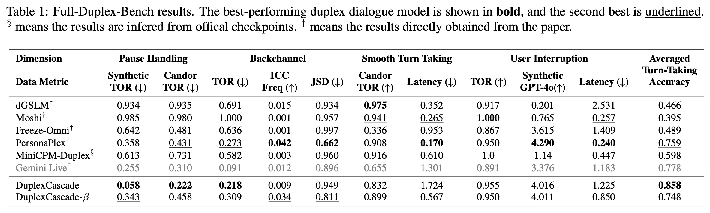
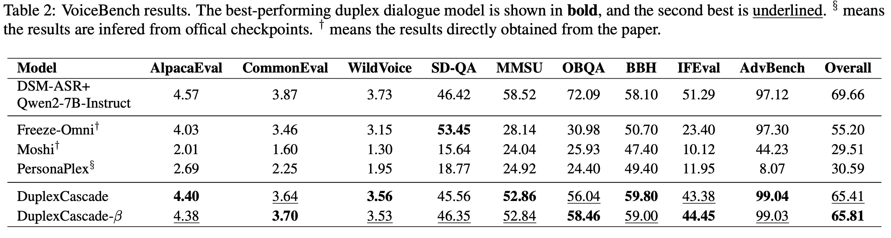

# DuplexCascade: Full-Duplex Speech-to-Speech Dialogue with VAD-Free Cascaded ASR-LLM-TTS Pipeline and Micro-Turn Optimization


<font size=7><div align='center'>[🎬 Demo Page](https://sbintuitions.github.io/DuplexCascadeDemo/) · [📄 Paper](https://arxiv.org/abs/2603.09180)</div></font>


## Contents <!-- omit in toc -->

- [Overview](#overview)
- [Evaluation Results](#evaluation-results)
- [Inference](#inference)
  - [Requirements](#requirements)
  - [Real-Time Demo](#real-time-demo)


## Overview

**DuplexCascade** is a full-duplex speech interaction model built on a cascaded **ASR–LLM–TTS** pipeline. It enables natural spoken dialogue while preserving the strong intelligence of a text-based LLM. 

### Key Features

* **Cascaded ASR–LLM–TTS Pipeline**
  DuplexCascade adopts a streaming cascaded architecture: the streaming ASR continuously transcribes user speech, the recognized text is periodically sent to the LLM for reasoning, and the generated response is synthesized in real time by a streaming TTS model. This design combines modularity with strong conversational capability. 

* **Micro-Turn Interaction**
  Instead of waiting for full utterances, DuplexCascade breaks dialogue into short, interleaved micro-turns. This allows faster bidirectional exchange and makes the interaction feel more natural and responsive.  


* **VAD-Free Turn-Taking Control**
  Unlike conventional cascaded systems that rely on an external Voice Activity Detection (VAD) module for turn-taking, DuplexCascade lets the LLM decide when to wait, respond, or backchannel. It does this by generating special conversational control tokens based on the incoming text stream, leading to more flexible and robust turn-taking behavior.  

* **Strong Full-Duplex Performance**
  DuplexCascade achieves strong turn-taking performance in full-duplex dialogue benchmarks while remaining competitive in conversational intelligence, showing that a cascaded design can support both natural interaction and capable language understanding.  

* **Text-Only Training with Strong Intelligence Retention**
  Traditional full-duplex spoken dialogue models often suffer from degraded intelligence because they jointly model text and audio tokens. In contrast, DuplexCascade only fine-tunes the LLM on text-based dialogue data, which allows it to support full-duplex interaction while largely preserving the original reasoning and instruction-following ability of the backbone LLM.  


## Evaluation Results

- Full-Duplex-Bench Results


- VoiceBench Results



## Inference

### Requirements

To run DuplexCascade, first clone the repository and set up the Python environment for the LLM component:

```bash
git clone https://github.com/sbintuitions/DuplexCascade.git
cd DuplexCascade

conda create -n DuplexCascade python=3.10 -y
conda activate DuplexCascade

pip install --upgrade pip
pip install -r requirements.txt
```

For the ASR and TTS backends, please follow the official instructions from [delayed-streams-modeling](https://github.com/kyutai-labs/delayed-streams-modeling) to install the Rust implementations of Kyutai Speech-to-Text and Kyutai Text-to-Speech.

### Real-Time Demo

DuplexCascade requires three components to be launched separately: ASR, TTS, and LLM. These can be started in different terminals or managed with `tmux`.

Start the ASR server:

```bash
moshi-server worker -p 31607 --config path_to_delayed-streams-modeling/configs/config-stt-en_fr-hf.toml
```

Start the TTS server:

```bash
moshi-server worker -p 31608 --config path_to_delayed-streams-modeling/configs/config-tts.toml
```

Start the LLM server:

```bash
python server.py
```

After all services are ready, the main demo server will run at:

```bash
0.0.0.0:31606
```

You can then interact with the system through the demo interface.


## Citation

If you use DuplexCascade in your research or project, please cite:

```bibtex
@article{yang2026duplexcascade,
  title={DuplexCascade: Full-Duplex Speech-to-Speech Dialogue with VAD-Free Cascaded ASR-LLM-TTS Pipeline and Micro-Turn Optimization},
  author={Jianing Yang and Yusuke Fujita and Yui Sudo},
  journal={arXiv preprint arXiv:2603.09180},
  year={2026}
}
```


## License

[MIT](./LICENSE)


## Related Works

This repository is closely related to several excellent open-source projects:

* **[delayed-streams-modeling](https://github.com/kyutai-labs/delayed-streams-modeling)**

* **[Full-Duplex-Bench](https://github.com/DanielLin94144/Full-Duplex-Bench)**

* **[VoiceBench](https://github.com/MatthewCYM/VoiceBench)**


